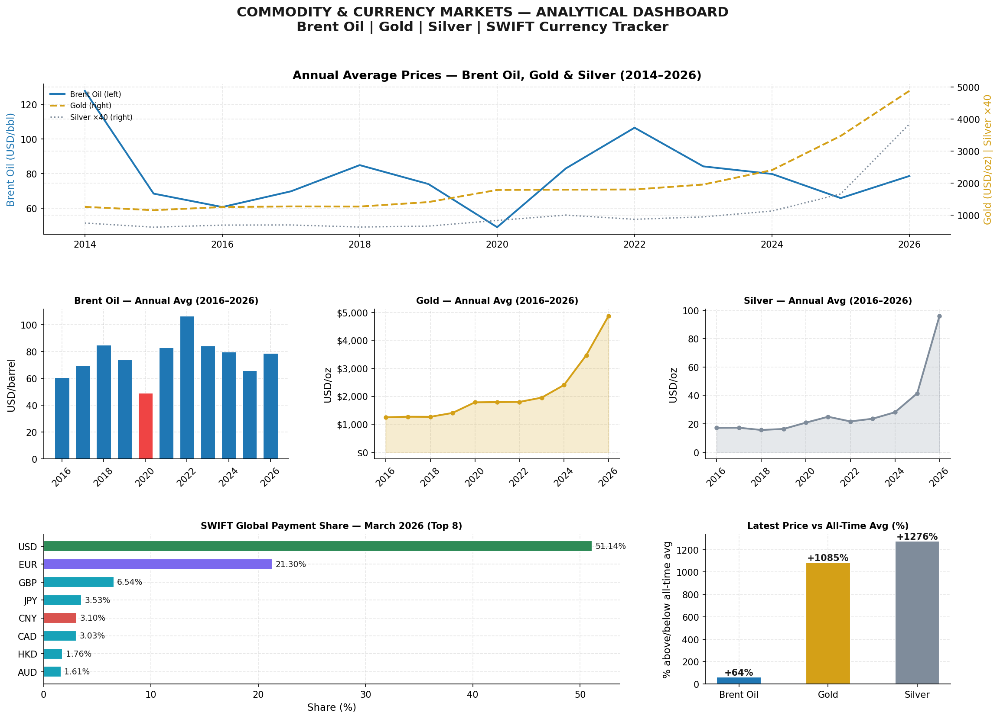
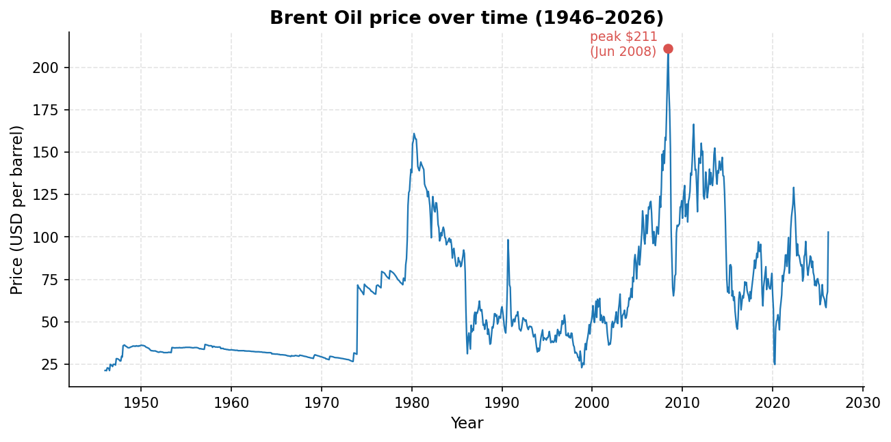
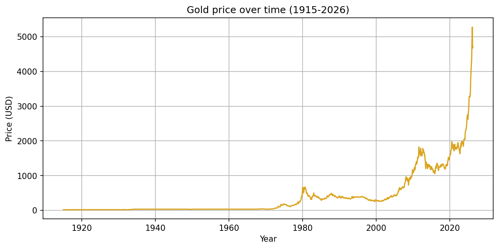
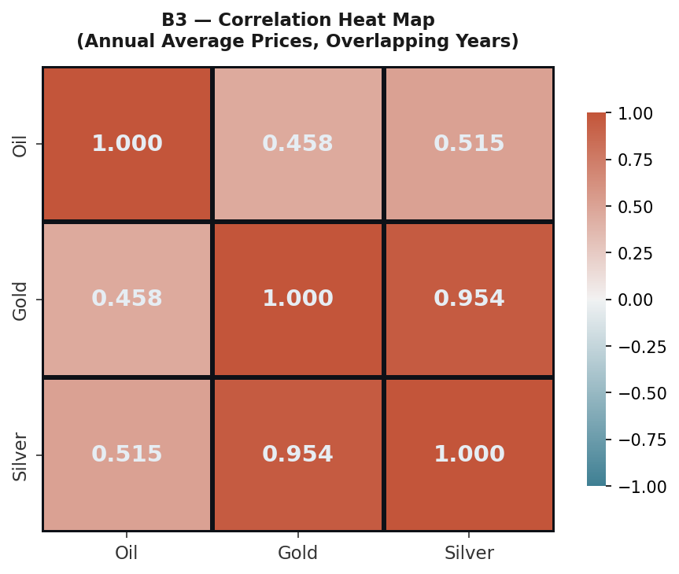
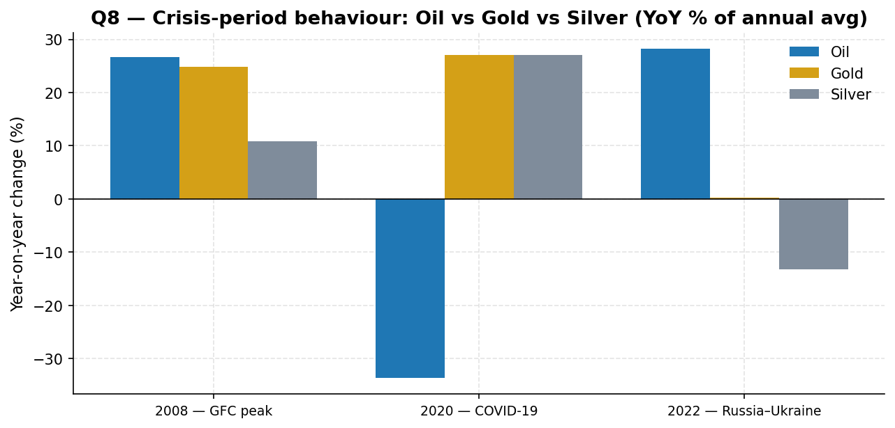
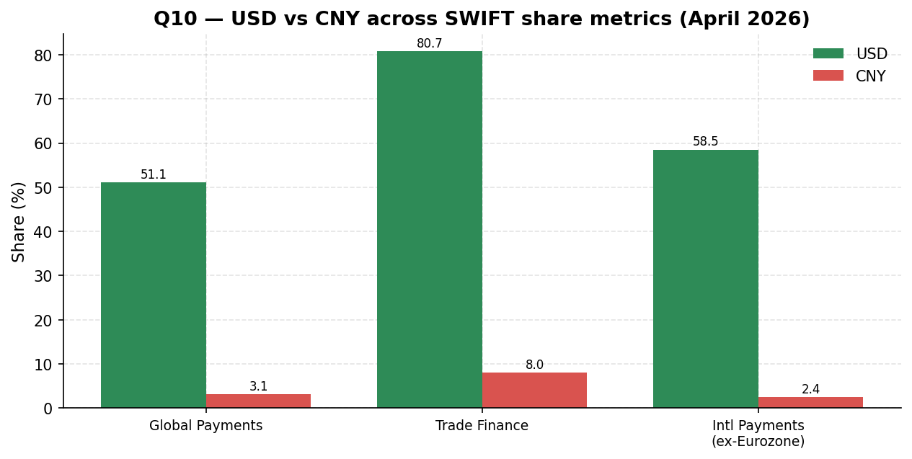

# DSC 120 A — DSB Group 8 Project

**Global Events, Commodities and Currency Markets** — an analysis of Brent oil, gold and silver prices over the past ~100 years and of which currencies actually settle the world's payments (based on monthly SWIFT tracker reports), with an attempt to connect observed price moves to major global events (oil shocks, the pandemic, the Russia-Ukraine war, the 2026 shipping disruption, etc.).

The project is written as a business report for a non-technical manager who has to make decisions about risk and market exposure.

Full report: [`DSB_Group8_Report.pdf`](./DSB_Group8_Report.pdf) · Presentation: [`DSB_Group8_Presentation.pptx`](./DSB_Group8_Presentation.pptx) · Consolidated results workbook: [`DSB_Group8_Workbook.xlsx`](./DSB_Group8_Workbook.xlsx)

## Data

| File | Coverage | Frequency |
|---|---|---|
| `Brent Oil.csv` | Jan 1946 – Mar 2026 | Monthly |
| `Gold 100years.csv` | Jan 1915 – Apr 2026 | Monthly |
| `silver 100 years.csv` | Jan 1915 – Apr 2026 | Monthly |
| `swift_currency_tracker_all_reports.csv` | 4 reports, Jan – Apr 2026 | Monthly reports |

## Repository structure

- `part1/` — descriptive statistics, trends, bonus questions (3 notebooks: `01_dataprep_descriptive`, `02_trends_currency`, `03_comparisons_bonus`) plus generated `figures/` and `tables/`
- `part2/` — market research linking events to prices (`market_research.ipynb`) plus its own `figures/` and `tables/`
- `src/` — shared `dsb_utils.py` module and `build_workbook.py`, which consolidates every exported CSV table into `DSB_Group8_Workbook.xlsx`
- `requirements.txt` — dependencies needed to reproduce the analysis

Every figure and table in the report is generated by these notebooks directly from the four raw files, with no manual editing of numbers.

## Key findings

**Three markets, three different speeds.**
- **Oil** is fast and event-driven: −33.6% in 2020 (pandemic), +28.2% in 2022 (invasion of Ukraine), +52% in a single month in early 2026 (shipping disruption).
- **Gold** is slow but structural: its annual average climbed every single year, from $1,799 in 2022 to $4,882 in 2026 (~2.7×), a pattern consistent with steady central-bank accumulation rather than a one-off fear spike. Silver tracks gold but overshoots (+131.5% in 2026).
- **Currencies barely move at all**: the US dollar holds 51.14% of global payments and 80.73% of trade finance; the renminbi is small in payments (3.10%) but is already the second trade-finance currency in the world (8.04%) — that's the channel where the growth is happening.

**The type of crisis decides the direction.** The 2020 demand shock sent oil down while both metals rose; the 2022 supply shock did the reverse — oil rose while gold barely moved and silver fell.

**Correlations on annual averages:** gold and silver move almost in lockstep (0.954), while oil correlates with them only moderately (0.458 and 0.515) — meaning metals and oil are driven by different forces (monetary vs. physical supply/demand).

### Recommendations from the report
1. Hedge oil exposure and treat a ±30% annual price swing as the planning case, not the stress case.
2. Hold gold as a deliberate strategic allocation, built up gradually, rather than a trade entered at the record high.
3. Keep settlement operations on the dollar, but start building renminbi capability now, since the growth in international settlement is happening on the trade-finance rail.

## Illustrations

**Summary dashboard of the main findings:**



**Brent oil, 1946–2026:** the 1973-74 and 1979-81 shocks, the 2008 peak, and the 2026 jump are all visible.



**Gold, 1915–2026:** the sharp rise after the dollar's link to gold was cut in 1971, and the sustained 2022–2026 climb.



**Correlation of annual average prices across the three commodities:**



**How the three markets reacted to three different crises (2008, 2020, 2022):**



**US dollar vs. renminbi across SWIFT metrics (April 2026):**



More charts and tables are available under `part1/figures`, `part1/tables`, `part2/figures`, `part2/tables`, and in `DSB_Group8_Workbook.xlsx`.

## Reproducing the analysis

```bash
python -m pip install -r requirements.txt
python -m ipykernel install --user --name python3
jupyter nbconvert --to notebook --execute --inplace part1/01_dataprep_descriptive.ipynb
jupyter nbconvert --to notebook --execute --inplace part1/02_trends_currency.ipynb
jupyter nbconvert --to notebook --execute --inplace part1/03_comparisons_bonus.ipynb
jupyter nbconvert --to notebook --execute --inplace part2/market_research.ipynb
python src/build_workbook.py
```

## Authors

Ivan Logutov, Siddhant Mathapati, Sudheer Chowdary, Muthoju Sandeep — University of Europe for Applied Sciences, Department of Business.
